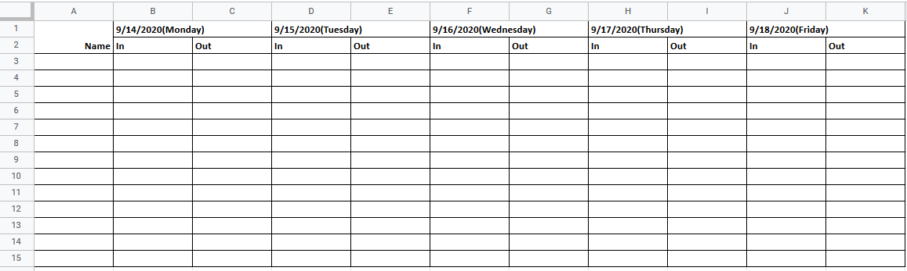

## How to run it:
1. `pip install -r requirements.txt`
 > or you could install the requirements in a virtualenv
2.  Go to [https://console.developers.google.com/](https://console.developers.google.com/). Create a project, enable google sheet api, create a service account, create a credential key, download the private key for that service account as json, rename it as **client.json** and save in the project folder.
3. `python main.py`

The format of the google sheet should be something like this
